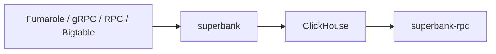

<div align="center">

<h1>
  
  <br/>Superbank
</h1>

[](https://github.com/solana-rpc/superbank/actions/workflows/ci.yml)

Ingest Solana ledger data into ClickHouse and serve Solana-compatible JSON-RPC from that data.

[Ingestor](crates/superbank/README.md) · [RPC server](crates/superbank-rpc/README.md) · [ClickHouse DDL](ddl/) · [k6 tests](tests/k6/README.md)

</div>

Superbank is a Rust workspace for ingesting Solana ledger data into ClickHouse and serving
Solana-compatible JSON-RPC endpoints backed by that data.

> [!NOTE]
> Superbank is licensed under **AGPL-3.0-only** (see `LICENSE`).
> `superbank-rpc` supports an optional in-memory gRPC "head cache" (`--features grpc-head-cache`) to reduce
> perceived ingestion lag and (optionally) expose `processed` commitment for a subset of methods,
> and an optional RocksDB "disk cache" (`--features disk-cache`) that serves recent finalized slots
> in place of ClickHouse. See `crates/superbank-rpc/README.md` for details.

## Features

- Ingest from Yellowstone Fumarole, Yellowstone gRPC (DragonsMouth), Solana JSON-RPC (`getBlock`), or Solana Bigtable
- Store blocks + transactions in ClickHouse (`ddl/`)
- Serve Solana-compatible JSON-RPC backed by ClickHouse (`crates/superbank-rpc`)
- Optionally expose ClickHouse-backed gRPC block and transaction streams (`--features grpc-streaming`)
- k6 load + validation scenarios for supported RPC methods (`tests/k6/`)

## Architecture



## Table of contents

- [Features](#features)
- [Architecture](#architecture)
- [Table of contents](#table-of-contents)
- [Quick start](#quick-start)
  - [1) Start ClickHouse (local)](#1-start-clickhouse-local)
  - [2) Create tables](#2-create-tables)
  - [3) Configure the ingestor](#3-configure-the-ingestor)
  - [4) Run the ingestor](#4-run-the-ingestor)
  - [5) Run the RPC server](#5-run-the-rpc-server)
- [Configuration](#configuration)
- [Load testing](#load-testing)
- [Repository layout](#repository-layout)
- [Development](#development)
  - [Nix (flakes)](#nix-flakes)
- [Contributing \& Docs](#contributing--docs)
- [License](#license)

## Quick start

### 1) Start ClickHouse (local)

```bash
	docker run -d --name clickhouse \
	  --ulimit nofile=262144:262144 \
	  -e CLICKHOUSE_SKIP_USER_SETUP=1 \
	  -p 8123:8123 -p 9000:9000 \
	  clickhouse/clickhouse-server:26.1.2.11
```

`CLICKHOUSE_SKIP_USER_SETUP=1` makes the image's `default` user reachable through the mapped
ports for local development. Do not use this insecure local-only setting for production
ClickHouse.

### 2) Create tables

For single-node ClickHouse (local dev), apply the schemas under `ddl/local/` in this order.
`transactions.sql` must be applied before the materialized-view schemas (`gsfa*.sql`,
`signatures.sql`, and `token_owner_activity.sql`) because those views read from the transactions
table.

```bash
cat ddl/local/transactions.sql | docker exec -i clickhouse clickhouse-client --multiquery
cat ddl/local/blocks_metadata.sql | docker exec -i clickhouse clickhouse-client --multiquery
# Required for Superbank Fumarole/gRPC source defaults and Old Faithful / Jetstreamer PoH entry ingestion.
cat ddl/local/entries.sql | docker exec -i clickhouse clickhouse-client --multiquery
cat ddl/local/gsfa.sql | docker exec -i clickhouse clickhouse-client --multiquery
cat ddl/local/signatures.sql | docker exec -i clickhouse clickhouse-client --multiquery
# Optional: required only for `tokenAccounts` filters in `getTransactionsForAddress`.
cat ddl/local/token_owner_activity.sql | docker exec -i clickhouse clickhouse-client --multiquery
```

If you use `gsfa_hot.sql` and want hot addresses excluded from the main GSFA table, apply
`ddl/local/gsfa_nohot.sql` instead of `ddl/local/gsfa.sql`, then apply `ddl/local/gsfa_hot.sql`.

For a one-command local PoH entries smoke test that starts or reuses ClickHouse, applies the
required local schemas, replays a small Old Faithful range through the Jetstreamer ClickHouse
plugin, and prints verification queries, run:

```bash
scripts/dev/run-jetstreamer-entries-smoke.sh
```

That helper also adjusts the local Docker ClickHouse `default` user so the host-side Jetstreamer
HTTP client can connect to `localhost:8123`.

For ClickHouse clusters, use `ddl/cluster/*.sql` when shard-local tables are plain
`ReplacingMergeTree`, or `ddl/replicated/*.sql` when shard-local tables should use
`ReplicatedReplacingMergeTree`. The replicated schemas require ClickHouse Keeper/ZooKeeper plus
`{cluster}`, `{shard}`, and `{replica}` macros configured in ClickHouse, and they assume the
cluster uses `internal_replication=1` for distributed inserts. See `ddl/README.md` for the full
schema set and `crates/superbank-rpc/README.md` for the required tables.

### 3) Configure the ingestor

```bash
cp superbank.example.yaml superbank.yaml
```

Edit `superbank.yaml` to choose a source and set credentials/endpoints:

- Fumarole: `source: fumarole`, `fumarole-endpoint`, `fumarole-consumer-group`, optional `fumarole-x-token`
- gRPC (DragonsMouth): `source: grpc`, `endpoint`, optional `x-token`
- RPC: `source: rpc`, `rpc-url`, `rpc-from-slot`, and either `rpc-to-slot` or `rpc-slot-count`
- Bigtable: `source: bigtable` plus range/slot file and GCP credentials
- Prometheus metrics: `metrics-host` / `metrics-port` (default `0.0.0.0:9901`, exposed at `/metrics`)
- Optional static metrics label: `metrics-cluster-label`

Full option reference: `crates/superbank/README.md`

### 4) Run the ingestor

```bash
cargo run -p superbank -- --config superbank.yaml
```

Minimal RPC-source example (ingest a bounded range via `getBlock`):

```bash
SUPERBANK_SOURCE=rpc \
RPC_URL=https://api.mainnet-beta.solana.com \
RPC_FROM_SLOT=0 \
RPC_SLOT_COUNT=1000 \
CLICKHOUSE_URL=http://localhost:8123 \
CLICKHOUSE_DATABASE=default \
cargo run -p superbank --
```

### 5) Run the RPC server

```bash
RPC_HOST=0.0.0.0 RPC_PORT=8899 \
CLICKHOUSE_URL=http://localhost:8123 CLICKHOUSE_DATABASE=default \
cargo run -p superbank-rpc --
```

Quick JSON-RPC smoke check (after ingesting some data):

```bash
curl -sS http://localhost:8899 \
  -H 'content-type: application/json' \
  -d '{"jsonrpc":"2.0","id":1,"method":"getFirstAvailableBlock"}'
```

## Configuration

- `superbank` supports YAML config, CLI flags, and environment variables.
  Precedence is: flags > env > config file > defaults.
  See `crates/superbank/README.md` and `superbank.example.yaml`.
  Fumarole ingest includes a default memory soft-limit backpressure guard; set
  `fumarole-memory-soft-limit-bytes: 0` only if you want to disable it.
- `superbank-rpc` is configured via CLI flags and environment variables.
  See `crates/superbank-rpc/README.md`.

## Load testing

Install k6 and run a basic scenario:

```bash
k6 run tests/k6/scenarios/basic/superbank-rpc-get-signatures.js -e RPC_URL=http://localhost:8899
```

Full suite docs + helper runner:

- `tests/k6/README.md`
- `scripts/test/run-k6.sh`

Quick RPC consistency probe for `getSignatureStatuses`:

```bash
python3 scripts/analysis/check-signature-status-consistency.py \
  --rpc-url http://localhost:8899 \
  --block-commitment confirmed \
  --max-slots-back 200 \
  --sample-size 100 \
  --poll-rounds 3 \
  --poll-interval-ms 250
```

This samples recent processed blocks, polls `getSignatureStatuses`, and flags cases where
`confirmations` and `confirmationStatus` disagree.

To inspect whether statuses progress cleanly over time, add:

```bash
python3 scripts/analysis/check-signature-status-consistency.py \
  --rpc-url http://localhost:8899 \
  --block-commitment confirmed \
  --sample-size 50 \
  --poll-rounds 40 \
  --poll-interval-ms 400 \
  --persist-until-finalized \
  --show-timelines
```

## ClickHouse Repair Helpers

To compare source and target clusters for missing block or transaction keys, run
`scripts/analysis/check-cluster-table-missing-keys.sh`. When the block metadata diff produces a
`blocks_metadata_local/missing-keys-epoch-*.csv` slot file, copy those slots from the trusted source
cluster into the target cluster with:

```bash
MISSING_SLOTS_FILE=cluster-missing-keys/blocks_metadata_local/missing-keys-epoch-980.csv \
SOURCE_CH_HOST=<source-control-host> SOURCE_CLUSTER=<source-cluster> \
TARGET_CH_HOST=<target-control-host> TARGET_CLUSTER=<target-cluster> \
scripts/analysis/copy-cluster-missing-blocks.sh
```

The copy helper inserts through the target `transactions` and `blocks_metadata` Distributed tables,
copying transaction rows before block metadata rows. Add `SKIP_EXISTING_TARGET_ROWS=1` to skip
rows already present on the target by exact table key instead of failing the run.

## Repository layout

- `crates/superbank` ingestor binary (Yellowstone Fumarole, Yellowstone gRPC, Solana JSON-RPC, or Solana Bigtable sources)
- `crates/superbank-rpc` Solana-compatible JSON-RPC server backed by ClickHouse
- `ddl/` ClickHouse schemas (transactions, block metadata, optional PoH entries, GSFA/signatures, token owner activity)
- `tests/k6/` load/validation tests for `superbank-rpc`
- `scripts/` helper scripts (local runs, analysis, k6 orchestration)
- `ingest/jetstreamer` git submodule — standalone Jetstreamer workspace (not part of the root Cargo workspace); requires `git clone --recurse-submodules` or `git submodule update --init`
- `ingest/jetstreamer-clickhouse-plugin` Jetstreamer ClickHouse ingestion plugin (standalone workspace — build with `cargo build --release` from within this directory, not `-p jetstreamer-clickhouse-plugin` from the repo root)

## Development

```bash
cargo build -p superbank -p superbank-rpc

cargo fmt --all -- --check
cargo clippy --workspace --all-targets --locked -- -D warnings
cargo test --workspace --locked
cargo test -p superbank-rpc --all-features --locked
```

Local RPC helper:

```bash
scripts/dev/run-local-rpc.sh
```

### Nix (flakes)

This repo includes a Nix flake with a dev shell that provides `tilt`, `docker`, `kubectl`, `kind`,
Rust tooling, `k6`, and common CLI utilities.

Enable flakes (if needed):

```bash
# ~/.config/nix/nix.conf
experimental-features = nix-command flakes
```

Enter the dev shell:

```bash
nix develop
```

If you don't want to change global Nix config, you can also run:

```bash
nix --extra-experimental-features 'nix-command flakes' develop
```

Note: the shell provides the Docker CLI, but you still need a running Docker daemon (or `DOCKER_HOST`
set) on your machine.

## Contributing & Docs

- [CONTRIBUTING.md](CONTRIBUTING.md)
- [docs/README.md](docs/README.md)
- [docs/agents/codex.md](docs/agents/codex.md)

## License

Copyright 2025-2026 Triton One Limited. All rights reserved.

Licensed under the GNU Affero General Public License v3.0 only. See `LICENSE`.
